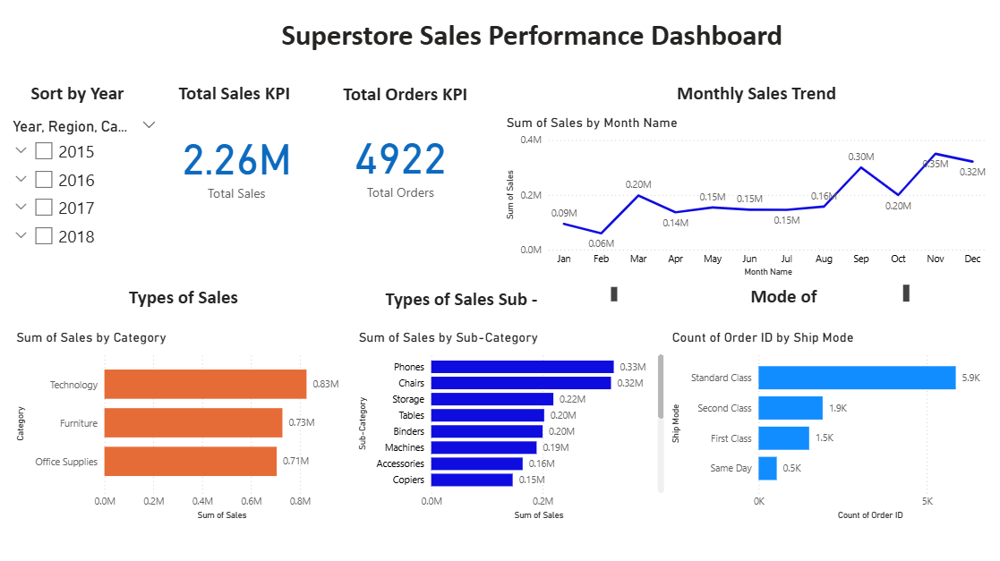
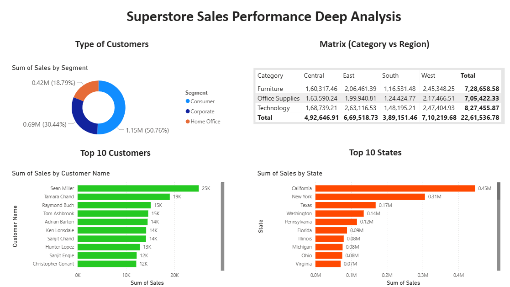

# 📊 Superstore Sales Performance Dashboard

## 🔍 Objective

Analyze sales data to uncover insights on revenue trends, customer behavior, and regional performance using data analytics and visualization tools.

---

## 📁 Dataset

* Source: Superstore Sales Dataset
* Kaggle Link: [Superstore Sales Dataset](https://www.kaggle.com/datasets/rohitsahoo/sales-forecasting)
* Includes order details such as sales, category, region, customer, and shipping data

---

## 🛠️ Tools & Technologies

* Python (Pandas) – Data Cleaning & Analysis
* Power BI – Dashboard & Visualization
* Excel – Initial exploration

---

## ⚙️ Data Preparation

* Converted date columns into proper datetime format
* Created new features: Year, Month, Month Name
* Cleaned missing and inconsistent data
* Exported processed dataset for visualization

---

## 📊 Dashboard Features

* KPI Cards: Total Sales, Total Orders, Average Sales
* Monthly Sales Trend Analysis
* Sales by Category and Sub-Category
* Customer Segmentation (Segment Analysis)
* Top 10 Customers by Revenue
* Interactive Filters (Year, Region, Category)

---

## 💡 Key Insights

* Certain categories contribute significantly to overall revenue
* Sales show clear trends across months and years
* A small group of customers drives a large portion of revenue
* Regional performance varies significantly across states

---

## 📸 Dashboard Preview



## Dashboard Analysis



---

## 📂 Project Structure

```
data/
notebooks/
dashboard/
images/
README.md
```

---

## ▶️ How to Use

1. Open Power BI file from `/dashboard`
2. Explore interactive filters and visuals
3. Refer to notebooks for data cleaning steps

---

## 🚀 Outcome

This project demonstrates end-to-end data analysis workflow:

* Data Cleaning
* Data Analysis
* Data Visualization
* Business Insight Generation
